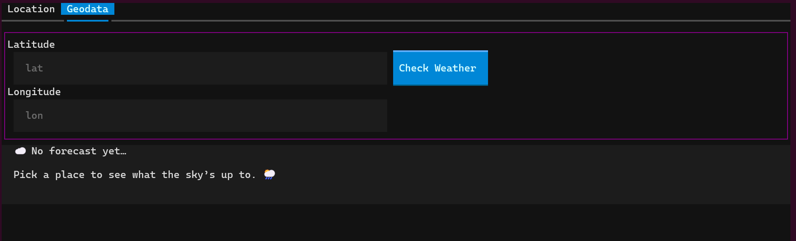
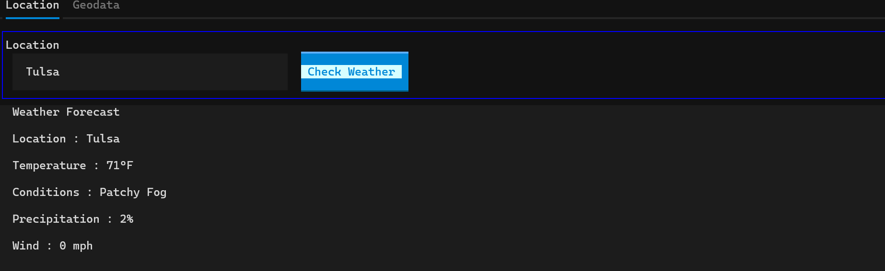
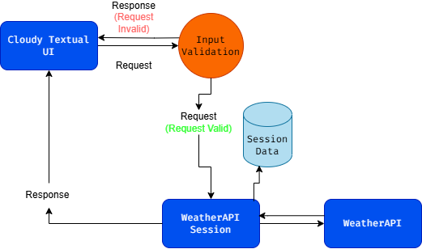

# Cloudy :sun_behind_rain_cloud:

Cloudy is a Textual based Weather App with a reuseable [National Weather Service API Client](api.weather.gov).

I made this project to try stateless UI and to try the [Textual](https://github.com/Textualize/textual) project.

### Stateless UI Diagram

